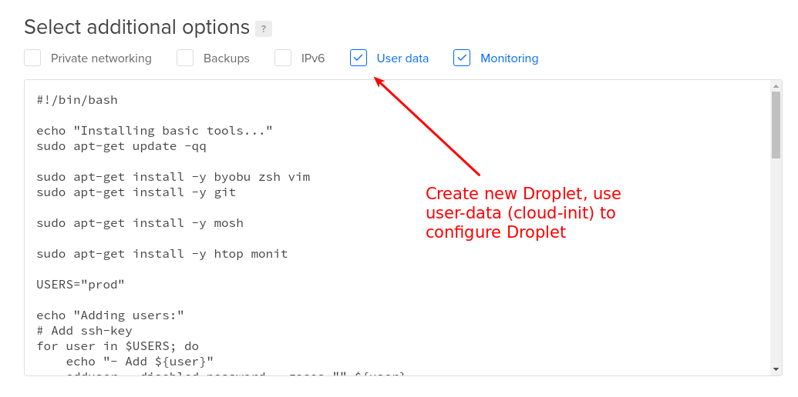

# Setup new server in Digital Ocean

## Step 1: Create new Droplet with user-data




## Step 2: Configure ssh config to login new server

```sh
vi ~/.ssh/config
```

```
Host egg-dev-01
    identityfile ~/.ssh/tranhuucuong91_at_gmail_dot_com
    hostname 188.166.144.122
    user prod
    port 22
```

## Step 3: Secure and Monitor the Server

1. SSH Server
2. Firewall
3. Monit

### 1. Secure SSH Server

**Edit file `/etc/ssh/sshd_config`:**

```sh
sudo vi /etc/ssh/sshd_config
```

```
# Change SSH Port
Port 2222

# Only allow root login without password.
PermitRootLogin without-password

# Only allow access by ssh-key
PasswordAuthentication no
```

**Restart SSH Service:**

```sh
sudo systemctl restart ssh
```

**Change ssh config to update `ssh port`.**

```
Host egg-dev-01
    identityfile ~/.ssh/tranhuucuong91_at_gmail_dot_com
    hostname 188.166.144.122
    user prod
    port 2222
```

### 2. Firewall

```sh
sudo ufw status                         # check status
sudo ufw status verbose
sudo ufw allow 2222/tcp                 # allow ssh port 2222
sudo ufw allow 60000:61000/udp          # allow mosh
sudo ufw enable                         # enable ufw

# Default policies
sudo ufw default deny incoming
sudo ufw default allow outgoing

# Allow all connect via docker0 interface
sudo ufw allow in on docker0 to any port 1:65535 proto tcp
sudo ufw allow in on docker0 to any port 1:65535 proto udp
```

### 3. Monit
**Configure monit:**

```sh
# Copy monit template
sudo cp monitrc_short-version_onfta.tmpl.cfg /etc/monit/monitrc

# Configure monit
# 1. Find and Replace: SERVER_NAME
# 2. Check Services
sudo vi /etc/monit/monitrc
```

**Reload monit and open firewall:**

```sh
# Reload monit
sudo systemctl reload monit
sudo systemctl status monit

# Allow Firewall for monit
sudo ufw allow 11180/tcp
```

**Access monit web:**
http://188.166.144.122:11180/

```
user: monit
pass: ke98gmcQru455Bykv2GR
```
